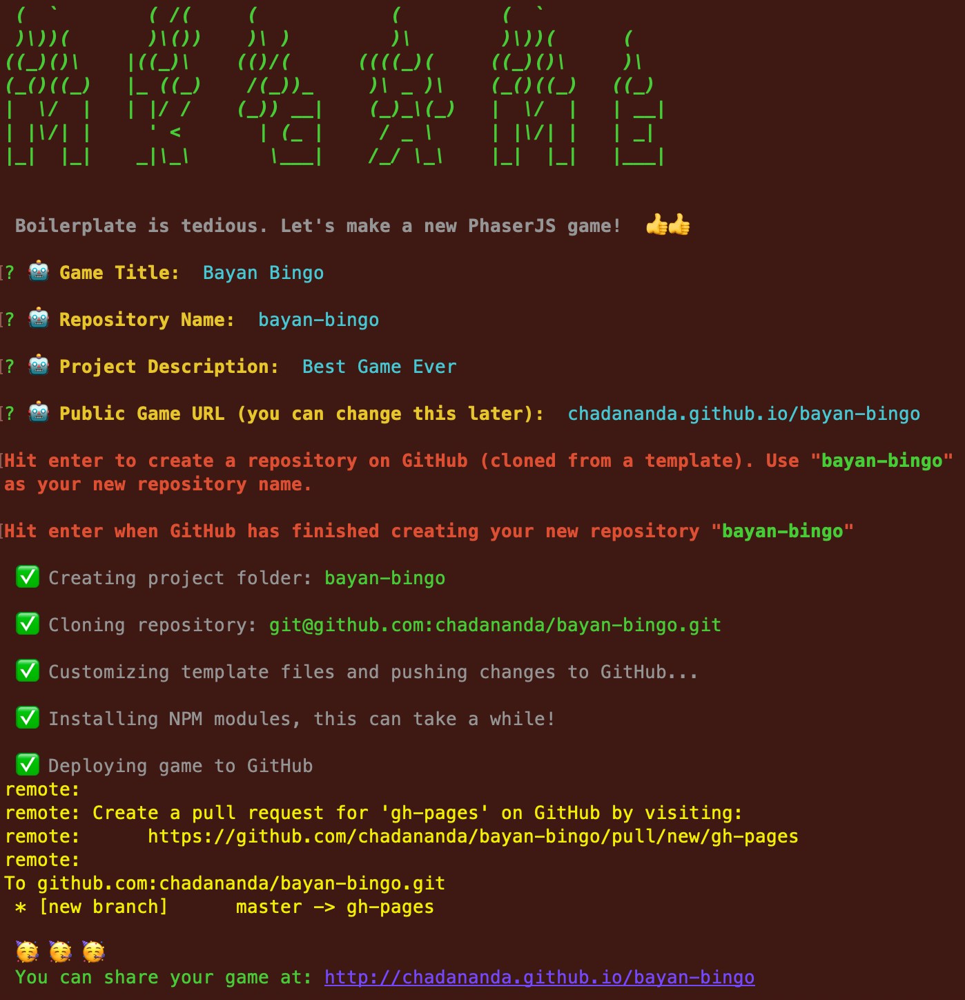

# mkgame -- a CLI wizard to fire up a new PhaserJS game project

<p align="center">
  
</p>

CLI tool for quickly setting up a new game project -- including local dev server, GitHUB repository and GitHub pages hosting of the deployed game

Too much boilerplate for setting up a new game. Now you can do it all with a single command and a CLI wizard.

This was an afternoon project I wrote to help my 7-yr-old son get started in PhaserJS game development. For some reason the PhaserJS docs are still in the '80s, suggesting using a local Apache server for development. Some great starter tempalts are avialable on GitHub to create a real local WebPack/NPM server environment -- but lots of manual replacements required. Since command line tools are easy and fun with NPM, and since GitHub now supports template repositories, I thought I'd sew together a few of these things into a single step.

## To install

```.js
npm i -g mkgame
```

## To Use

After installing globally, invoke like:

```.js
mkgame "Bayan Bingo"
```

A `bayan_bingo` repository will be created from the template [phaser-auto-template](https://github.com/chadananda/phaser-auto-template) and cloned to a `bayan_bingo` directory. All kinds of stuff will be replaced out with 'Bayan Bingo' the game shell will be published to a gh-pages branch of the repo, ready to share with the world.


## To Use a custom Domain

If you choose to use a custom domain, <kbd>mkgame</kbd> will create a CNAME file for you. You will still have the responsibility to point your domain to GitHub's name servers. You can read more about that here:

[Managing a custom domain for your GitHub Pages site](https://docs.github.com/en/github/working-with-github-pages/managing-a-custom-domain-for-your-github-pages-site)


